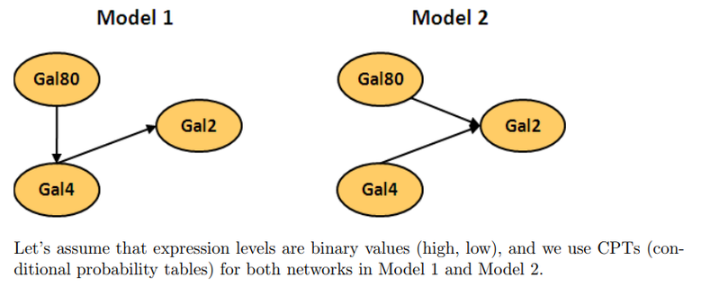

```{r setup, include=FALSE}
knitr::opts_chunk$set(echo = TRUE)

library(ggplot2)
library(reshape2)
```


# Problem Set #4
# Due Date: Thursday, May 24th

### Problem 1


Variables and values: 
G80: Gal80 Expression, Val(G80) = {G80^0^, G80^1^}
G4: Gal4 Expression, Val(G4) = {G4^0^, G4^1^}
G2: Gal2 Expression, Val(G2) = {G2^0^, G2^1^}

#### 1a
**Model 1 and Model 2 have different Bayesian network structures, and so they have different sets of parameters (θ). List all parameters and the CPTs in each of Model 1 and Model 2.**

Model 1:  
$\theta_1$ = {G80, G4|G80, G2|G4}

**CPT(Gal80):  **

| G80^0^ | G80^1^ |
| --------------- | --------------- |
| P(G80^0^)  | P(G80^1^)  |

**CPT(Gal4):  **

|   | G4^0^ | G4^1^ |
|---| --------------- | --------------- |
| **G80^0^** | P(G4^0^\|G80^0^)  | P(G4^1^\|G80^0^)  |
| **G80^1^** | P(G4^0^\|G80^1^)  | P(G4^1^\|G80^1^)  |

**CPT(Gal2):  **

|   | G2^0^ | G2^1^ |
|---| --------------- | --------------- |
| **G4^0^** | P(G2^0^\|G4^0^)  | P(G2^1^\|G4^0^)  |
| **G4^1^** | P(G2^0^\|G4^1^)  | P(G2^1^\|G4^1^)  |

Model 2:  
$\theta_2$ = {G80, G4, G2|G80,G4}

**CPT(Gal80):  **

| G80^0^ | G80^1^ |
| --------------- | --------------- |
| P(G80^0^)  | P(G80^1^)  |

**CPT(Gal4):  **

| G4^0^ | G4^1^ |
| --------------- | --------------- |
| P(G4^0^)  | P(G4^1^)  |

**CPT(Gal2):  **

|                                      | G2^0^                   | G2^1^ |
|------------                         | ---------------                   | --------------- |
| **G80^0^, G4^0^** | P(G2^0^\|G80^0^, G4^0^)  | P(G2^1^\|G80^0^, G4^0^)  |
| **G80^0^, G4^1^** | P(G2^0^\|G80^0^, G4^1^)  | P(G2^1^\|G80^0^, G4^1^)  |
| **G80^1^, G4^0^** | P(G2^0^\|G80^1^, G4^0^)  | P(G2^1^\|G80^1^, G4^0^)  |
| **G80^1^, G4^1^** | P(G2^0^\|G80^1^, G4^1^)  | P(G2^1^\|G80^1^, G4^1^)  |

#### 1b
**Say that we are given the gene expression data D measuring binary expression levels of the 3 genes (Gal80, Gal4 and Gal2) across 112 samples. Write down the likelihood function L(D|θ) for Model 1 and Model 2.**

L($\theta$ : D) = P(D|$\theta$)

Model 1:  
$\theta_1$ = {G80, G4|G80, G2|G4}  
$L_1(\theta_1:D) = P(D|\theta_1) = \displaystyle\prod_{i=1}^{112} P(G80 = G80_i) \cdot P(G4 = G4_i | G80_i) \cdot P(G2 = G2_i|G4_i)$

Model 1:  
$\theta_2$ = {G80, G4, G2|G80,G4}
$L_2(\theta_2:D) = P(D|\theta_2) = \displaystyle\prod_{i=1}^{112} P(G80 = G80_i) \cdot P(G4 = G4_i) \cdot P(G2 = G2_i|G80_i, G4_i)$

#### 1c
**Write down the maximum likelihood estimation (MLE) solutions in Model 1 and Model 2.**

#### 1d
**Download the binary expression data from https://sites.google.com/a/cs.washington.edu/genome560-spr18/disc-gal80-gal4-gal2.txt?attredirects=0&d=1, and implement the code that computes the log-likelihood function log (L) for Model 1 and Model 2.**

```{r}
gal_data = read.csv('https://sites.google.com/a/cs.washington.edu/genome560-spr18/disc-gal80-gal4-gal2.txt?attredirects=0&d=1', sep='\t')

gal_data = t(gal_data)

colnames(gal_data) = gal_data[1,]
row.names(gal_data) = NULL

gal_data = gal_data[-1,]

gal_data = data.frame(gal_data)

gal_data = sapply(gal_data, as.numeric)

```

```{r}
sum(gal_data$Gal80)
```


```{r}


```