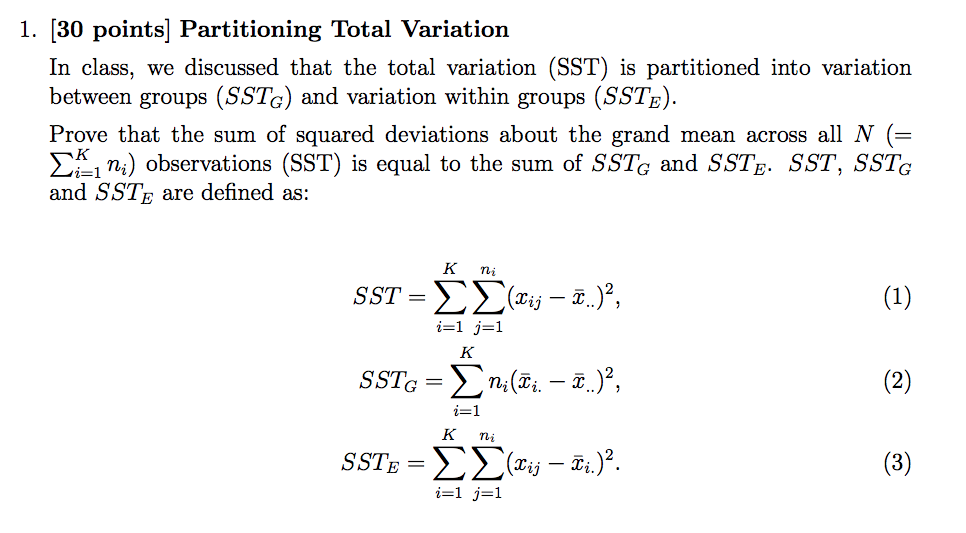
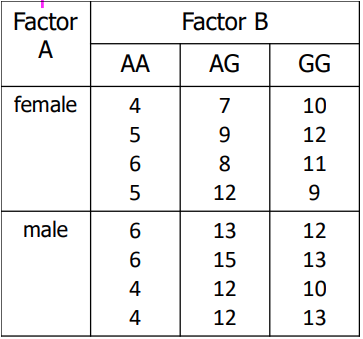

```{r setup, include=FALSE}
knitr::opts_chunk$set(echo = TRUE)
```

```{r}
# packages
library(ggplot2)

```

## Problem Set #5
### David Bacsik
### Due: Thursday, June 7th

### Problem #1 HELP

Partitioning total variation.


### Problem #2
Complete the ANOVA table above from the values given. The sample size is N = 20.

|  Source of Variation 	|  Sum of Squares 	|  df 	|  Mean Square 	|  F 	|
|---	|---	|---	|---	|---	|
|  Group 	|  56.7 	|   	|   	|   	|
|  Error 	|   	|   14	|  13.5 	|   	|
|   Total	|   	|   	|   	|   	|

Since N = 20, and N-k = 14, k must equal 6.

I can then calculate the df for each line.  
Then, I can calculate the sum of squares or mean squares, respectively, for each line using the given information and df.  
The total sum of squares will be equal to SS(G)+SS(E).

Finally, I will find the F statistic as MS(G) divided by MS(E).

Results:

|  Source of Variation 	|  Sum of Squares 	|  df 	|  Mean Square 	|  F 	|
|---	|---	|---	|---	|---	|
|  Group 	|  56.7 	|  5 	|   11.34	|   0.84	|
|  Error 	| 189  	|   14	|  13.5 	|   	|
|   Total	|  245.7 	|  19 	|   	|   	|

### Problem #3
Complete the two-way ANOVA table for the example problem we discussed in class.  The data table is on slide 18 of lecture note 19.

Data:  

Results:

|  Source of Variation 	|  Sum of Squares 	|  df 	|  Mean Square 	|  F 	|
|---	|---	|---	|---	|---	|
|  Gender 	| 20.167	|   1	|   20.167	|  9.811 	|
|  Genotype 	|   200.333	|  2 	|   100.167	|  48.730 	|
|  Gender-Genotype  |  16.333   |   2  |   8.167  |  3.973   |
|  Error  | 37  |  18  |  2.056 |   |
|   Total	|  273.833 	|  23 	|   	|   	|

### Problem #4
**In this exercise, we will examine the influence of the stress reduction method and age on the stress level. The dataset contains a hypothetical sample of 27 participants who are divided into three stress reduction treatment groups (mental, physical, and medical) and three age groups (young, mid, and old). The stress reduction values are represented on a scale that ranges from 0 to 10. This dataset can be conceptualized as a comparison between three stress treatment programs – one using mental methods, one using physical training, and one using medication – across three age groups. The stress reduction values represent how effective the treatment programs were at reducing participant’s stress levels, with higher numbers indicating higher effectiveness.**

```{r}
stress_data = read.table(file="http://www.cs.washington.edu/homes/suinlee/genome560/data/stress_reduction.txt")
stress_data = stress_data[,2:4]
colnames(stress_data) = c('method','age','score')
head(stress_data)
```

#### #4 a
**We learned that we need to first test whether there is a significant interaction between the factors. Is there an interaction between the treatment and age (i.e., p-value< 0.05)? What is the p-value of the interaction term? If you think that there is an interaction, solve part (b) and (c). Otherwise, solve part (d) and (e).**

```{r}
m1 = lm(score ~ age*method, data=stress_data)
anova(m1)
```

I do not believe there is an interaction between age and treatment. The p-value for the interaction term in the ANOVA table is 1.  I will solve parts (d) and (e).

#### #4 d
**If an interaction is not significant, we can then test for significance of the main effects separately, again using an one-way ANOVA. Report the result of an one-way ANOVA by copying and pasting the relevant parts of the results. What are the p-values?**

I will run two one-way ANOVA tests, one on each factor. This will tell me the effect of changing that factor, while holding the other factor constant.

```{r}
m2 = lm(score ~ age, data=stress_data)
anova(m2)
```

For age, the p-value is 1.3e-9. This is highly significant.

```{r}
m3 = lm(score ~ method, data=stress_data)
anova(m3)
```

For treatment, the p-value is 0.3186. This is not significant.

From this, I conclude that there is a main effect driven by age, but not a main effect driven by treatment.

#### #4 e
**There are 3 levels in each factor. We learned that when there are more than two levels, we can better understand the mean differences among the levels, through pairwise comparisons of the levels. For the factor(s) that has a significant main effect (i.e., p-value < 0.05), perform three separate one-way ANOVA for three pairs of levels, for example, a ‘young’ and ’mid’ pair, a ’mid’ and ’old’ pair, and a ’young’ and ’old’ pair.**

Based on the results in part (a) and (d), I have concluded that only the age factor has a significant effect.  I will subset the data into pairs of levels (e.g. young+mid, mid+old, old+young), plot them, and perform ANOVA tests for each.

For the young + mid age group pair, the ANOVA was highly significant with a p-value of 8.8e-5. There is clearly a better response in the young group than in the mid group.

```{r}
young_mid = stress_data[which(stress_data$age=='young' | stress_data$age=='mid'), ]

m.young_mid = lm(score ~ age, data=young_mid)

ggplot(data=young_mid, aes(x=age, y=score)) + geom_point(stat='summary', fun.y=mean)

anova(m.young_mid)
```

For the mid+old age pair, there was also a significant result to the ANOVA test. The p-value is exactly the same, 8.8e-5. The mid age group responded better than the old age group.

```{r}
mid_old = stress_data[which(stress_data$age=='mid' | stress_data$age=='old'), ]

m.mid_old = lm(score ~ age, data=mid_old)

ggplot(data=mid_old, aes(x=age, y=score)) + geom_point(stat='summary', fun.y=mean)

anova(m.mid_old)
```

Finally, for the young + old age group pair, the young age group responded much better. The ANOVA produced a p-value was orders of magnitude lower (more significant), 1.6e-8.

```{r}
young_old = stress_data[which(stress_data$age=='young' | stress_data$age=='old'), ]

m.young_old = lm(score ~ age, data=young_old)

ggplot(data=young_old, aes(x=age, y=score)) + geom_point(stat='summary', fun.y=mean)

anova(m.young_old)
```

### Problem #5
**We are given the genotype data from 334 mouse individuals produced by the backcross experiment. The genotype data measure the genotype values of 1333 genetic markers for each mouse, and the phenotype data measure the normalized blood cholesterol levels. The genotype data have binary values, because the mice were produced from the backcross experiment. Given these data, we want to find the quantitative trait loci (QTLs) that contribute to elevated cholesterol level.**

**For each marker, we will perform the t-test to measure the significance of the the differences in the phenotype between the mice that have genotype ‘0’ and those that have genotype ‘1’.**

First, I will load the data into a dataframe:
```{r}
genotype = read.table('genotype.txt', sep='\t', strip.white=TRUE, stringsAsFactors = TRUE)

genotype = t(genotype)

colnames(genotype) = genotype[1,]
row.names(genotype) = NULL

genotype = genotype[-1,-1]

genotype = data.frame(genotype)

genotype = lapply(genotype, trimws)

genotype = lapply(genotype, as.numeric)

genotype = data.frame(genotype)

phenotype = read.table('phenotype.txt', sep='\t', strip.white=TRUE, stringsAsFactors = TRUE)

phenotype = t(phenotype)

colnames(phenotype) = phenotype[1,]
row.names(phenotype) = NULL

phenotype = phenotype[-1,-1]

phenotype = data.frame(phenotype)

phenotype = lapply(phenotype, trimws)

phenotype = lapply(phenotype, as.numeric)

phenotype = data.frame(phenotype)

chol_data = data.frame(genotype, phenotype)

head(chol_data)
```

Then, I will write a function to calculate the p-value of a t-test which checks whether one genotype of a given marker produces a significantly different phenotype value than the other genotyep of the marker.

```{r}
library(lazyeval)

marker.p = function(m){
  if(m != 'phenotype'){
    x = chol_data[[m]]
    return(t.test(chol_data$phenotype~x)$p.value)
  }
  else{
    return(NULL)
  }
}
```

#### #5 a
**Generate a set of p-values each of which means the significance of the association between each marker and the phenotype. Plot the histogram of the 1333 p-values. Provide the code. How many markers have p-value smaller than 0.05?**

Next, I will find the p-value for each individual marker.
```{r}
pvals = lapply(names(chol_data), marker.p)
pvals = data.frame(unlist(pvals))
colnames(pvals) = 'p.value'
head(pvals)
```

I will plot the histogram of p-values:

```{r}
pvals.hist = ggplot(data=pvals, aes(p.value)) + geom_histogram(bins=50)
pvals.hist
```

Finally, I will count the number of markers with a p-value less than 0.05. There are 84 markers with p-values that small.
```{r}
alpha = 0.05
tabulate(as.numeric(pvals < alpha))

```

#### #5 b
**Apply the Bonferroni correction method, Holm method, and B-H FDR correction method to the set of p-values you obtained in part (a). With the significance level of 0.05 and 0.01, how many markers are considered signifiant after correction in each of the three methods?**

Since we are repeatedly doing ~1 thousand t-tests, it makes sense to apply som ekind of multiplhe hypothesis testing. I will test two (pre-correction) significance levels: 0.05 and 0.01 After Bonferoni correction, there are 7 p-values significant at 0.05, and 7 p-values significant at 0.01.  
The Bonferonni method is the most stringent, and I will apply it first. It simply divides by the number of tests performed (e.g. number of items in p-value list). 
```{r}
alpha5 = 0.05
alpha1 = 0.01

pvals.list = unlist(pvals)

pvals.bonferroni = p.adjust(pvals.list, method = 'bonferroni', n = length(pvals.list))
pvals.bonferroni = data.frame(pvals.bonferroni)
colnames(pvals.bonferroni) = 'p.value'

tabulate(as.numeric(pvals.bonferroni < alpha5))
tabulate(as.numeric(pvals.bonferroni < alpha1))
```

Next, I will test the Holm method. After Holm correction, there are 7 p-values significant at 0.05, and 7 p-values significant at 0.01.  

```{r}
pvals.holm = p.adjust(pvals.list, method = 'holm', n = length(pvals.list))
pvals.holm = data.frame(pvals.holm)
colnames(pvals.holm) = 'p.value'


tabulate(as.numeric(pvals.holm < alpha5))
tabulate(as.numeric(pvals.holm < alpha1))
```

Finally, I will test the BH FDR method. After FDR correction, there are 13 markers significant at 0.05, and 7 markers significant at 0.01.

```{r}
pvals.fdr = p.adjust(pvals.list, method = 'fdr', n = length(pvals.list))
pvals.fdr = data.frame(pvals.fdr)
colnames(pvals.fdr) = 'p.value'

tabulate(as.numeric(pvals.fdr < alpha5))
tabulate(as.numeric(pvals.fdr < alpha1))
```

#### #5 c
**Plot the histograms of the corrected p-values in each of the three methods. Show the four histograms in one figure.**

```{r}
par( mfrow = c(2,2) )
hist(unlist(pvals), breaks = 50, main='uncorrected')
hist(unlist(pvals.bonferroni), breaks= 50, main='bonferroni')
hist(unlist(pvals.holm), breaks= 50, main='holm')
hist(unlist(pvals.fdr), breaks= 50, main='fdr')
```